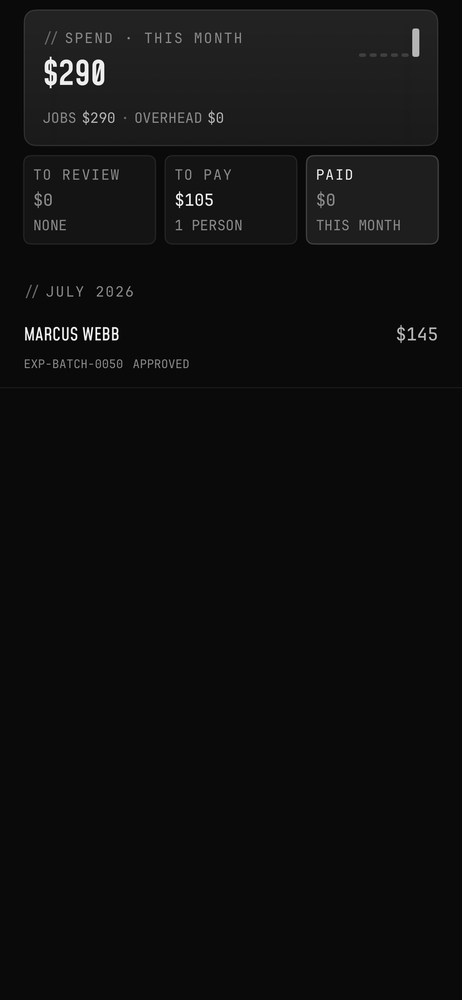
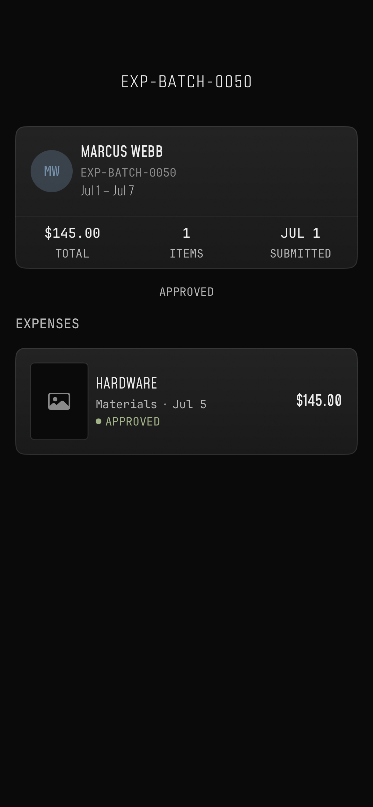
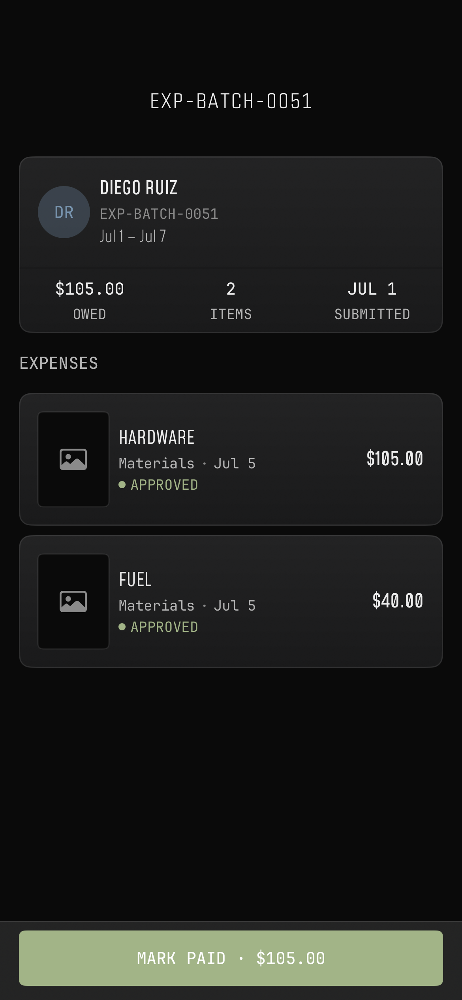

# Expense reimbursement visual proof

Exported and visually inspected on 2026-09-14 from the completed P5 simulator run. No build or test was rerun to create this proof.

- Tested iOS source: `f3e7fa28b4c552da3d934abc560bf006ab588745`.
- Result: `/private/tmp/ops-ios-bugs-p5/expense-tests-1.xcresult`.
- Test: `ExpenseConsoleSnapshotTests/testRenderCompanyFundedHistoryAndMixedReimbursement()`.
- Simulator: `0510A40A-DBCA-45E2-A1ED-6E29C52C5F46`.
- Completed run: 60 tests, zero failures (15 batch approval, 34 bucket/DTO, 3 snapshot, 8 decision notification tests). See [test summary](test-summary.txt).
- Screenshots are the original exported 1170×2532 PNG attachments, unchanged. [Attachment manifest](attachment-manifest.json) records their source names and SHA-256 hashes.

## Visual findings

| Capture | Observed behavior |
| --- | --- |
| [Company-funded history](console-company-funded-history.png) | Spend remains $290 across both fixture batches. The company-funded $145 row is discoverable as APPROVED. TO PAY is $105 for one person; PAID is $0. |
| [Company-funded detail](detail-company-funded-approved.png) | $145 TOTAL, one approved receipt, APPROVED lifecycle label. No Mark paid action, Undo payout action, or paid stamp. |
| [Mixed reimbursement detail](detail-mixed-reimbursement.png) | $105 OWED and MARK PAID · $105.00. Both the $105 crew receipt and $40 company-card receipt remain visible. Tax is already included in the $105 gross reimbursement. |

Text, amounts, row alignment, and the bottom payout action remain legible with no visible clipping or overlap. The history uses the existing row and approved-status treatment. These are deterministic fixture renders of production views, not a signed-in device workflow or live accounting-provider test.

