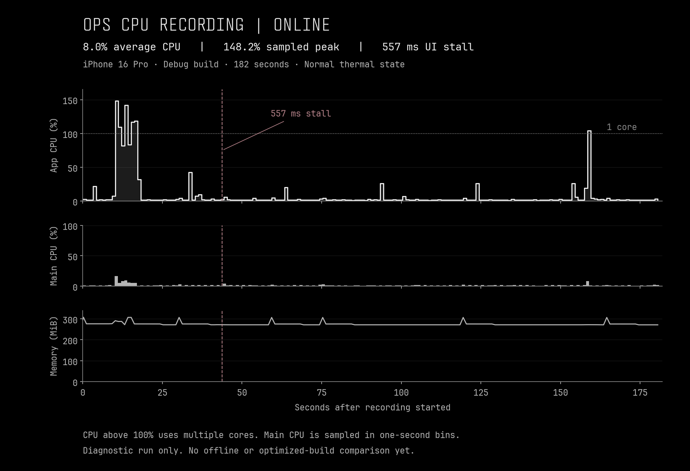

# Online iPhone CPU measurement — September 7, 2026

The three-minute recording caught one 557 ms main-thread stall despite average app CPU use of 8.0%. Memory did not grow persistently during this short run, and thermal state remained nominal. This establishes a remaining responsiveness issue in the measured Debug build. It does not establish an optimized before/after speedup or isolate the effect of connectivity.

| Measurement | Result |
| --- | --- |
| Recording duration | 181.572 seconds |
| Duration-weighted average app CPU | 7.989% |
| Highest approximately one-second CPU sample | 148.208% at 10.189 seconds |
| CPU time consumed during recording | 14.489 seconds |
| Main-thread stalls detected at the 250 ms threshold | One: 557.231 ms, starting at 43.771 seconds |
| Physical memory footprint | 296.2 MiB initially; 307.7 MiB peak; 271.5 MiB finally |
| Device thermal state | Nominal throughout |

CPU percentage uses 100% for one core, so work across multiple cores can exceed 100%. The peak is a sampled interval, not an instantaneous maximum. The main-thread chart is a sampling estimate aggregated into one-second bins. Smaller hitches may exist below the hang detector's threshold.

## Recording and build provenance

- Physical iPhone 16 Pro, iOS 26.6.1, online; Time Profiler plus Activity Monitor attached to the existing running OPS process. No app install, reset or database export occurred in this measurement session.
- The user confirmed readiness and was instructed to open a visit, edit notes/checklist, take photos, use the deck designer, then return/save. The exact actions performed and perceived pauses remain awaiting user confirmation; this is not a verified completion of that script.
- Measured binary: arm64 `OPS.debug.dylib`, UUID `43B4CF87-BC00-39CE-B46F-B80B93CBFEB3`. Its UUID matches the available local Debug binary. Symbol inspection independently confirmed `DataActorModelExecutor`, `ReviewSnapshotStore` and `reportWasSuperseded`, establishing that these key repairs are present. Exact source revision remains unproven.
- Activity Monitor yielded 181 valid CPU samples at approximately one-second intervals. Its cumulative CPU counter was already nonzero when attached; the reported CPU time subtracts the initial counter. The average is duration-weighted.
- Time Profiler recorded 14,294 ms of sampled CPU across all threads, including 2,693 ms on main. These sampled totals are distinct from Activity Monitor's cumulative CPU counter.

## Remaining diagnostic lead

The samples on main during the 557 ms stall pass through Mapbox's display-link update and annotation synchronization, including `AnnotationManagerImpl.implementationName`, Swift type reflection and dynamic casts. The inspected dependency source constructs this annotation-manager name with `String(describing: AnnotationType.self)` in the update/signpost path.

Only 29 ms of sampled main-thread CPU falls inside the 557 ms wall-time stall. Those samples identify code present during the stall but cannot account for the full pause or prove that type reflection caused it. A thread-state recording is needed to distinguish running, waiting and scheduling delays if this reproduces. Mapbox is statically linked into the app binary, so app-binary frames are not necessarily first-party OPS code. Inclusive stack times overlap and must not be added together.

Apple's [main-thread activity analysis](https://developer.apple.com/tutorials/instruments/analyzing-main-thread-activity) describes the distinction between CPU work and a blocked main thread. The measured pause should be investigated independently of the low recording-wide average.

## Next comparable test

1. Establish USB data transport. Current CoreDevice transport is `localNetwork`; independent USB inventories did not identify the iPhone. Airplane mode would sever the profiler connection in this configuration.
2. Use one known optimized build containing the integrated repairs and preserve the separate header-overlay work already on local main. Coordinate any install with other device owners. The signed integration candidate alone predates that header change.
3. Record the same timed visit/notes/checklist/photos/deck/save/reopen sequence online, offline and during reconnect. Identify each action and perceived pause, preserve equivalent data/workload, and record CPU, hangs, memory and thermal state. Check saved work after reopening and syncing.
4. If the map-related stall recurs, record thread states alongside CPU activity to establish its full cause before changing code. Do not compare this Debug workflow run directly to the earlier optimized startup-only trace.

## Evidence files

- `online-summary.json`: sanitized aggregates, binary identity and sampled stack summaries.
- `online-cpu-series.csv`: CPU and memory series used for the chart.
- `online-cpu-timeline.png` and `.svg`: inspected chart and scalable export.
- Raw Instruments trace and exported tables remain in private temporary storage at `/private/tmp/ops-ios-cpu-measurement-20260907/`. They are excluded from Git. No customer records, credentials or raw device logs are included in this report.
